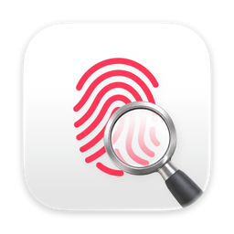

# Who Sudo'd



Who Sudo'd shows the process tree that caused a macOS authentication prompt or an interactive terminal `sudo` request.

## Features

- Shows the requesting app and its process chain beside SecurityAgent and LocalAuthentication prompts.
- Shows the full process chain and pending command for terminal `sudo` requests from the MacBook notch, or at the top center of a display without a notch.
- Keeps an active request visible across app and display changes until the request ends or you dismiss it.
- Can ignore selected apps for each supported prompt type.
- Offers optional PAM integration. You can enter a `sudo` password in Who Sudo'd or in the terminal. Touch ID, smart cards, YubiKeys, and other earlier PAM methods continue to work.

## Install

Who Sudo'd requires Apple silicon and macOS 26 or later.

1. Download the [latest notarized release](https://github.com/zats/who-sudod/releases/latest).
2. Move **Who Sudo'd.app** to **Applications**, then open it.
3. Open **Settings > General** and select **Accessibility**. Add Who Sudo'd in **System Settings > Privacy & Security > Device Control and Data Access**.
4. Optional: select **Install…** next to **PAM** to enable password input for terminal `sudo`.

The app runs in the menu bar. PAM installation needs administrator approval but does not need a restart.

## Privacy and system changes

All process inspection and password transfer stay on the Mac. Who Sudo'd does not log or store passwords.

Without the optional PAM feature, the app does not read authentication input. With PAM enabled, a password entered in the app goes directly to the waiting PAM conversation. The original terminal input remains active, and the first complete password wins.

The PAM actions install signed components and add two owned lines to `/etc/pam.d/sudo`. Install, repair, and uninstall keep all other PAM entries and their order. The app does not modify SecurityAgent or the `sudo` executable, and SIP can stay enabled.

## Limits

Request attribution depends on observed macOS log and Accessibility behavior that Apple can change. Terminal `sudo` detection uses live process and terminal state. macOS does not provide exact terminal tab attribution.

## Development

The Xcode project is generated from `project.yml` and is not tracked.

```sh
Tools/generate-project.zsh
xcodebuild -project WhoSudod.xcodeproj -scheme WhoSudod -configuration Debug -derivedDataPath .build build
xcodebuild -project WhoSudod.xcodeproj -scheme WhoSudod -destination 'platform=macOS' -derivedDataPath .build test
Tools/test-pam.zsh
```

The notch surface uses the MIT-licensed [DynamicNotchKit](https://github.com/zats/DynamicNotchKit). Its license is included with the app.
